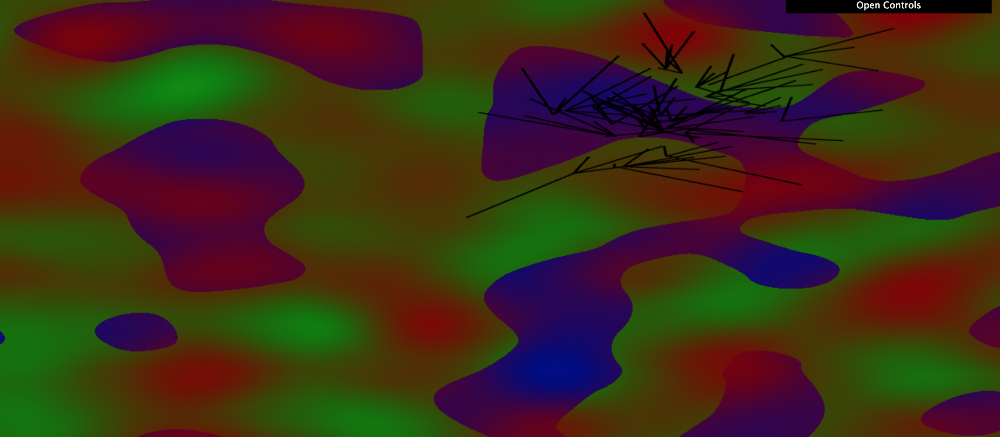

CIS 566 Homework 5: Road Generation

## Overview

Matthew Riley\
PennKey: matriley\
Live at: https://mgriley.github.io/hw05-road-generation/

## Description:

I was not able to finish the whole process of map generation to road generation, but I'll describe my progress. First, a shader program called inputMapShader renders the land height and population density to an offscreen RGBA texture (storing the the values as the x and y float components). Then, glReadPixels is used to copy the texture data representing the map to the CPU. The turtle may sample this map while deciding upon new routes. However, it does not currently use the samples, as sampling the texture at position (x,y) does not yield the expected data for that position. The expected data is instead at an offset position in the texture. I was not able to fix that bug, so you can likely see roads spanning into the water. Right now, road generation uses a very simple bread-first-search. It generates the instance data from a list of edges representing the roads. The edges do not merge using the techniques described in the paper linked in the instructions. After the generation process, three shaders run every loop. First, the inputMapShader must run (again) because WebGL may have discarded its texture data in the interim since it was first generated. The terrain shader reads this to draw the blue for the water, green for the grass, and the red tinge for population density. Lastly, the instanced shader draws the road network. I suspect that I also have a bug in the code that determines the angle that child roads branch off from their parent, which would partially explain the above mess.

